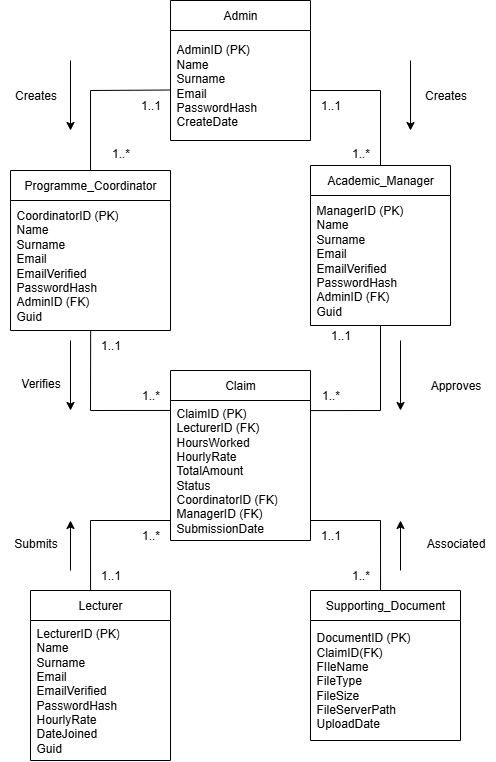

# ST10444262-PROG6212-POE
______________________
INTRODUCTION
----------------
This POE entails the creation of a Contract Monthly Claim System (CMCS). The 
purpose of this system is to streamline the submission and approval of monthly claims 
for the independently contracted lecturers. Lecturers will be able to submit claims 
based on their hourly wage and hours worked, and any relevant supporting 
documents, where once submitted it can be verified by the Programme Co-ordinator 
and finally approved by the Academic Manager. Claim status will be transparent 
throughout the administrative process. The key users for this system is the lecturer 
who will be submitting the claims, the Programme Co-ordinator who will be verifying 
the claims, the Academic Manager who will accept the claims, and finally an Admin 
whose sole responsibility is the account creation of both Programme Co-ordinator and 
Academic Manager and will not interfere with any of the claim processes. The project 
is currently in its prototype phase outlining the projects database, GUI and project plan, 
which mean that there is no current functionality.
______________
DESIGN CHOICES
-----------------
The document is structured into design choices, the UML Class diagram for the 
database, Project Plan, and the systems GUI UI, and ended off with any relevant 
referenced resources. 

<ins>**Layout**</ins>

  The layout for the menu will be generally the same across the board for every user 
  excluding the admin who will only have a creation and deletion button. The menu bar 
  or navigation bar is located at the top of the page for all views and all users, ensuring 
  the menu is consistent with the rest of the application and reinforcing what the user 
  will expect of the system going forward. The menu bar includes a logout button and a 
  help button ensuring the user does not get stuck. The menus used for each user has 
  been implemented with usability and ease of use in mind ensuring the user cannot get 
  stuck on a page and that every page has clear navigation buttons. Each view display 
  only what is needed by that user ensuring the user only sees what they need. 

<ins>**Lecturer Dashboard**</ins>

  The lecturer will have a 3 central buttons on their dashboard being “Profile”, “Create 
  Claim”, and “All Claims”, the dashboard will include a quick overview below these 
  buttons showing that lecturers pending claims, accepted claims and total claimed in 
  Rands. 
  
<ins>**Programme Co-ordinator/Academic Manager Dashboard**</ins> 

  The dashboard for the Co-ordinator/Manager stays consistent with the way the 
  Lecturer dashboard was setup using the 3 central buttons being “Profile”, “Review a 
  Claim”, and “Review History”. Below these is the quick overview section consisting of 
  “Claims Pending Review”, and “Reviewed Claims” allowing the user to quickly view 
  how many claims they need to view without having to click the “Review a Claim” button. 
  
<ins>**Colour Scheme**</ins> 

  The colours used include dark navy blue for the menu bar, white for the background, 
  blue for the view/mange buttons, green for the action buttons, red for the reject buttons, 
  and yellow for the pending status. The use of dark navy blue for the menu bar and 
  white for the background was used as these colours are associated with trust and 
  reliability, where reliability is essential for a system like this (Olesen, 2025). Blue is 
  used for buttons that aren’t the primary focus for that user or a stepping stone to get 
  to another button such as a accept button . Green used for the accept button and main 
  focus buttons as it is universally associated with positivity or confirmation. Red is 
  associated with negativity and stopping something which is why it was used to reject 
  a claim. Yellow was used for the pending status as its colour is associated with 
  optimism (Olesen, 2025). All these colours have been consistently used through the 
  prototype ensuring that each colour can subconsciously indicates the buttons use. 
  
<ins>**Assumptions & Constraints**</ins>

* *Assumptions*  

• Lecturer can only make a single claim per month 

• Every lecturer is paid based on hourly wage and hours worked which is inputted 
each time 

• Supporting documentation is required with every claim 

• Every lecturer will have to sign-up 

• Admin creates/deletes the Co-ordinators/Managers 

• Database stores lecturer details, corresponding claim details, Co
  ordinator/Manager Details  

• If a claim is rejected a reason can be provided by the reviewer. 

* *Constraints* 

• File uploads are restricted to .pdf, docx, and .xlsx with a size limit of 5MB 

• The system must be developed using MVC .NET Core 

• Prototype must be non-functional using MVC or FIGMA 

• Project must have continuous version control with descriptive comments 

• Entity Framework must be used to interact with the data in the database 
________________
UML CLASS DIAGRAM FOR DATABASE
----------------

  

  This UML diagram outlines the tables and attributes need for system to function. Every 
  user has PasswordHash which is the encrypted version of the user’s password 
  ensuring security. Globally Unique Identifier or GUID is used to verify the user's email 
  address ensuring that the user can get email notifications based on the claim progress. 
  Supporting_Document contains the documents metadata, and it associated with each 
  claim. The claim table stores all relevant claim information and takes the Co
  ordinator/Manager Id once they have verified/accepted the claim allowing the claim to 
  be viewed from their side of the application. This ensures that the database will be 
  implemented with everything needed to create an operational CMCS.
  ______
  PROJECT PLAN
-------------

